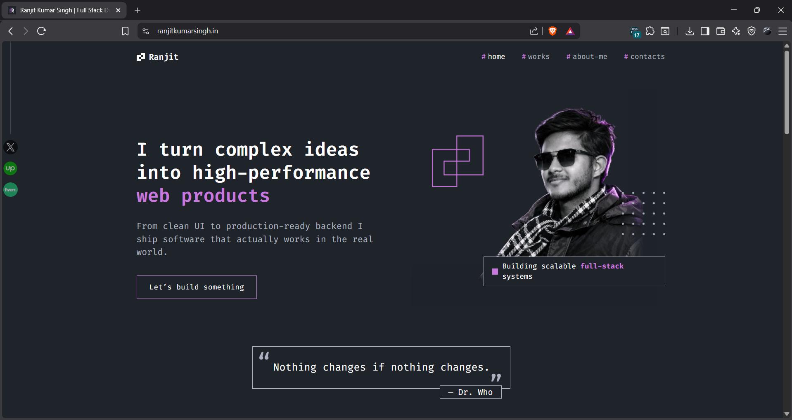
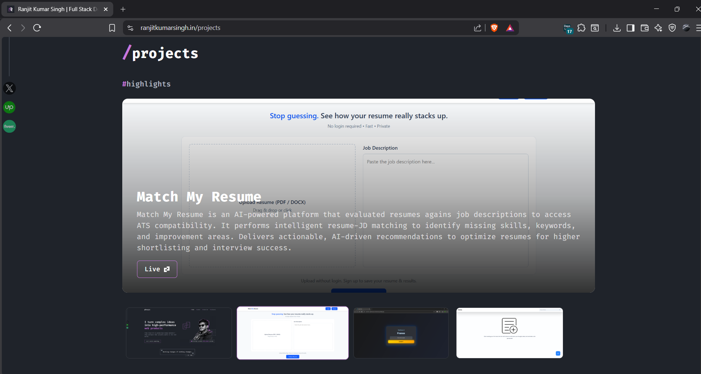
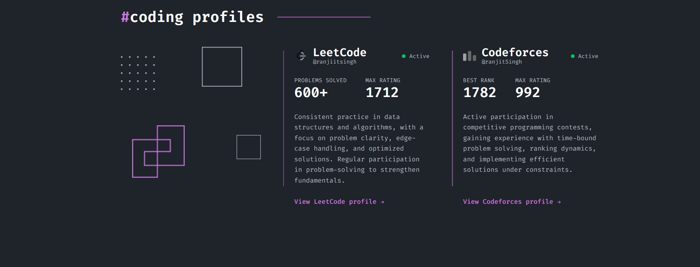
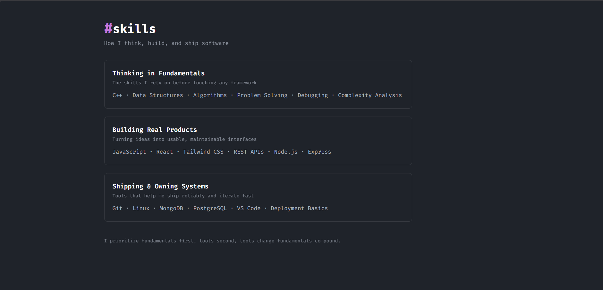
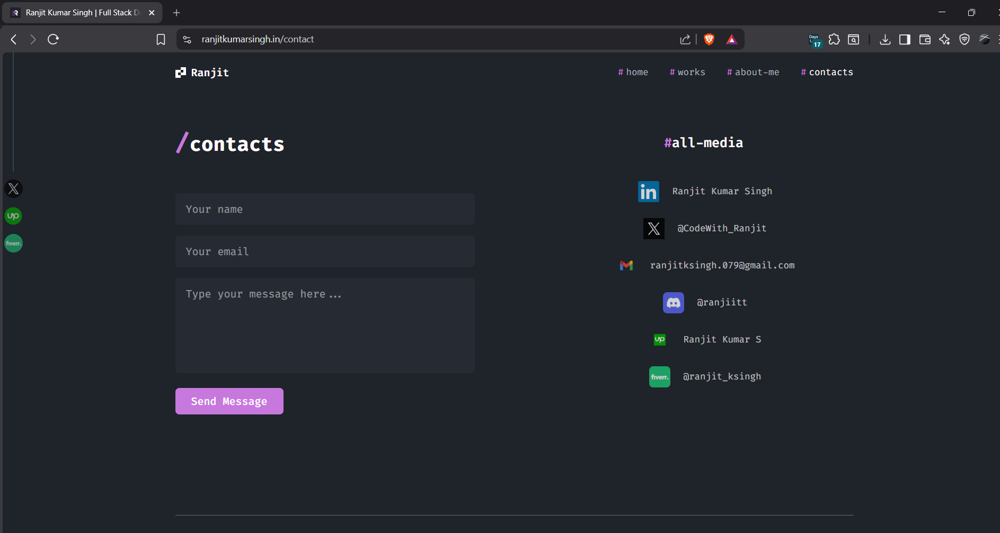

<div align="center">

# Ranjit Kumar Singh : Developer Portfolio

### A developer portfolio engineered to showcase projects, problem-solving, and software craftsmanship.

[](https://ranjitkumarsingh.in)
[](https://react.dev)
[](https://tailwindcss.com)
[](https://vercel.com)

<br/>



</div>

<br/>

## ✨ Overview

This repository is the source code for my personal developer portfolio — a single-page React application showcasing my projects, competitive programming track record, skills, and a working contact channel. It's deployed on **Vercel** and served on a custom domain, **[ranjitkumarsingh.in](https://ranjitkumarsingh.in)**.

The design philosophy was simple: **a terminal-inspired, dark, premium interface that feels like a developer's workspace, not a template.** Section headers use a `#tag` / `/path` naming convention (`#projects`, `#skills`, `/about me`) to reinforce that identity throughout the site.

<br/>

## 🧠 Why This Project Exists

Most portfolios are static brochures. This one is built to actually demonstrate engineering decisions a reviewer would care about:

- **Component-driven architecture** - every section (project cards, coding-profile stats, contact form) is an isolated, reusable component with a clean prop contract.
- **Real, working integrations** - the contact form sends actual emails via EmailJS; no `mailto:` placeholder.
- **Data-driven rendering** - the featured-projects carousel is powered by a single `data/project.js` source of truth, not hardcoded JSX.
- **Motion with intent** - parallax hero, count-up stat animations, and hover transitions are used to add polish without becoming distracting.

<br/>

## 🚀 Features

| Feature | Description |
|---|---|
| **Animated Hero** | Mouse-tracked parallax effect on the hero illustration, built with `mousemove` event tracking and transform interpolation. |
| **Featured Project Showcase** | Auto-rotating carousel (4s interval) with manual thumbnail selection that resets the timer — built with `useRef` + `setInterval` cleanup to avoid memory leaks. |
| **Coding Profile Stats** | LeetCode and Codeforces stats with a custom `useCountUp` hook that animates numbers into view. |
| **Live Contact Form** | Fully functional form using **EmailJS** — no backend required, sends directly to my inbox with success/error states. |
| **Responsive Project Grid** | Three card variants (`ProjectCard`, `NewProjectCard`, `ProjectRow`) used contextually for grid, hover-reveal, and detailed-row layouts. |
| **Client-side Routing** | `react-router-dom` powers Home, Projects, About, and Contact as distinct routes without a page reload. |
| **Consistent Design System** | A single purple accent color, monospace-leaning headers, and reusable Tailwind utility patterns across every page. |

<br/>

## 🛠️ Tech Stack

**Frontend** — React.js (Vite), React Router DOM, Tailwind CSS
**Integrations** — EmailJS (contact form), Google Fonts
**Hosting** — Vercel, with a custom domain (`ranjitkumarsingh.in`)
**Tooling** — ESLint, PostCSS, Autoprefixer

<br/>

## 📂 Project Structure

```
src/
├── assets/
│   └── images/             # Logos, illustrations, decorative SVGs/PNGs
├── components/
│   ├── TopNavbar.jsx        # Top navigation (desktop)
│   ├── LeftNavbar.jsx       # Social/profile sidebar
│   ├── Quote.jsx            # Hero quote card
│   ├── ProjectCard.jsx      # Grid-style project card
│   ├── NewProjectCard.jsx   # Hover-reveal project card
│   ├── ProjectRow.jsx       # Full-width detailed project row
│   ├── ProjectShowcase.jsx  # Auto-rotating featured carousel
│   ├── CodingProfileCard.jsx# LeetCode/Codeforces stat card
│   ├── SkillinAbout.jsx     # Skills breakdown (About page)
│   ├── Facts.jsx            # "Some facts" tag cloud
│   ├── ContactForm.jsx      # EmailJS-powered contact form
│   ├── ContactIcon.jsx      # Social/media link row item
│   └── Footer.jsx           # Site footer
├── pages/
│   ├── Home.jsx
│   ├── Project.jsx
│   ├── About.jsx
│   └── Contact.jsx
├── data/
│   └── project.js            # Single source of truth for featured projects
├── useCountUp.js              # Custom hook for animated stat counters
└── App.jsx                    # Route definitions + layout shell
```

<br/>

## 🖼️ Screenshots

<table>
<tr>
<td width="50%">

**Projects Section**


</td>
<td width="50%">

**Coding Profiles**


</td>
</tr>
<tr>
<td width="50%">

**Skills**


</td>
<td width="50%">

**Contact**


</td>
</tr>
<tr>
<td width="50%">

**Project Detail View**


</td>
<td width="50%">

**Skills Breakdown**


</td>
</tr>
</table>

<br/>

## ⚡ Getting Started

```bash
# 1. Clone the repository
git clone https://github.com/<your-username>/<your-repo>.git
cd <your-repo>

# 2. Install dependencies
npm install

# 3. Add environment variables (see below)
cp .env.example .env

# 4. Run the dev server
npm run dev
```

### Environment Variables

The contact form uses EmailJS. Create a `.env` file with:

```
VITE_EMAILJS_SERVICE_ID=your_service_id
VITE_EMAILJS_TEMPLATE_ID=your_template_id
VITE_EMAILJS_PUBLIC_KEY=your_public_key
```

> EmailJS public keys are designed to be exposed client-side, but moving them out of the component and into environment variables keeps the codebase clean and makes the project portable across environments (dev/staging/prod) without code edits.

<br/>

## ☁️ Deployment

This project is deployed on **Vercel** with continuous deployment from the `main` branch, and is mapped to a custom domain (`ranjitkumarsingh.in`) via Vercel's domain settings.

```bash
npm run build     # outputs to /dist
```

Push to `main` → Vercel auto-builds and deploys. No manual steps required.

<br/>

## 🗺️ Roadmap

- [ ] Move EmailJS keys to `.env` (currently inline for simplicity)
- [ ] Add a blog/notes section for write-ups on DSA and system design
- [ ] Add light mode toggle
- [ ] Add unit tests for `useCountUp` and form validation

<br/>

## 📬 Contact

- **LinkedIn:** [Ranjit Kumar Singh](https://www.linkedin.com/in/ranjit-kumar-singh/)
- **Email:** ranjitksingh.079@gmail.com
- **Twitter/X:** [@CodeWith_Ranjit](https://x.com/CodeWith_Ranjit)
- **Live Site:** [ranjitkumarsingh.in](https://ranjitkumarsingh.in)

<br/>

## 📄 License

This project is open for reference and learning purposes. If you fork or reuse parts of it, a credit back to this repo is appreciated.

<div align="center">

 *"Nothing changes if nothing changes."*

</div>
